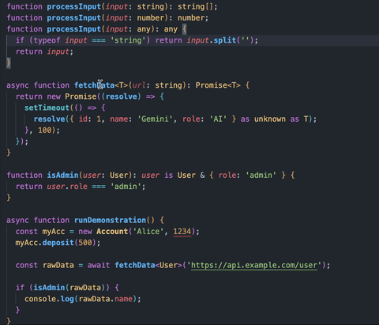
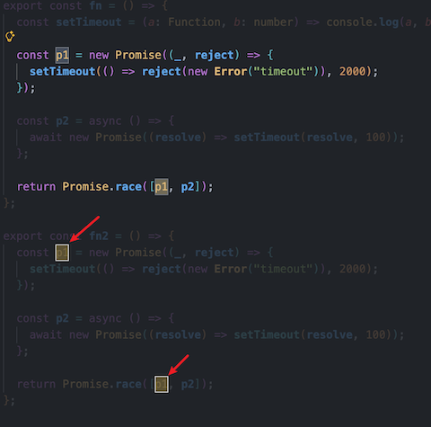

# Code Dimmer - Highlight Variables Hide Others

[](https://marketplace.visualstudio.com/items?itemName=char8x.vscode-code-dimmer)
[](https://github.com/char8x/vscode-code-dimmer/releases/latest)


本插件是一款通过降低无关代码透明度，帮助用户在阅读时集中注意力的工具

## 快速上手

双击变量名即可查看效果



## 功能特性

### 高亮变量声明

双击变量名，即可高亮显示该变量声明所在的起始代码块


### 高亮变量引用

双击变量名，将高亮显示该变量的所有使用位置


## 常见问题排除

### 双击变量名称后无效果

有以下几种情况:

- 该变量没有被引用, 只在当前位置出现
- 代码相应的语言服务器（Language Server）没有开启

### “选择高亮边框”造成的视觉干扰

有时，配色方案（ColorTheme）中包含了 `editor.selectionHighlightBorder` 的样式。受限于 VS Code 扩展 API 的能力，该特定项无法被程序直接覆盖，只能通过自定义配置设置来解决



您可以通过在 `.vscode/settings.json` 中添加以下代码来解决此问题：

```json
"workbench.colorCustomizations": {
  "editor.selectionHighlightBorder": "default"
}
```

## 功能局限

- 该拓展依赖于语言服务器（Language Server）提供的代码范围结果, 其他语言服务器相比于内置的 `JavaScript/TypeScript` 支持程度有些许差别
- 若要实现更细粒度的高亮显示，有赖于语言服务器（Language Server）能力的提升，特别是其将变量范围精确追踪到“列”级别的能力

## 致谢

- [LaurieWired](https://x.com/lauriewired/status/1980401405761581422) 灵感源自她的推文

## 许可证

MIT
